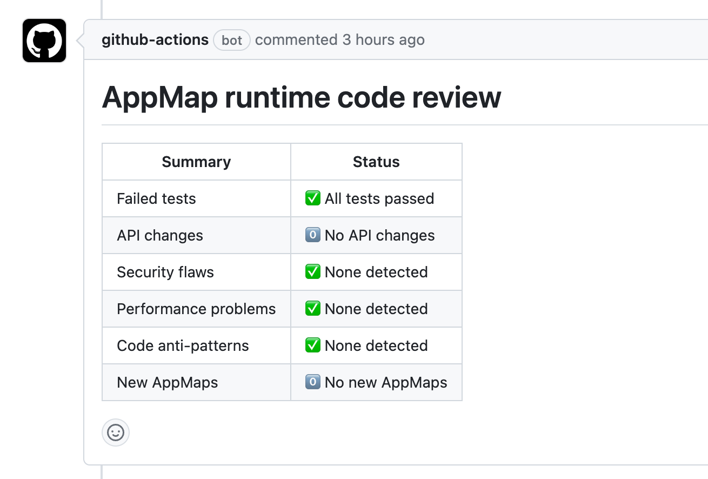
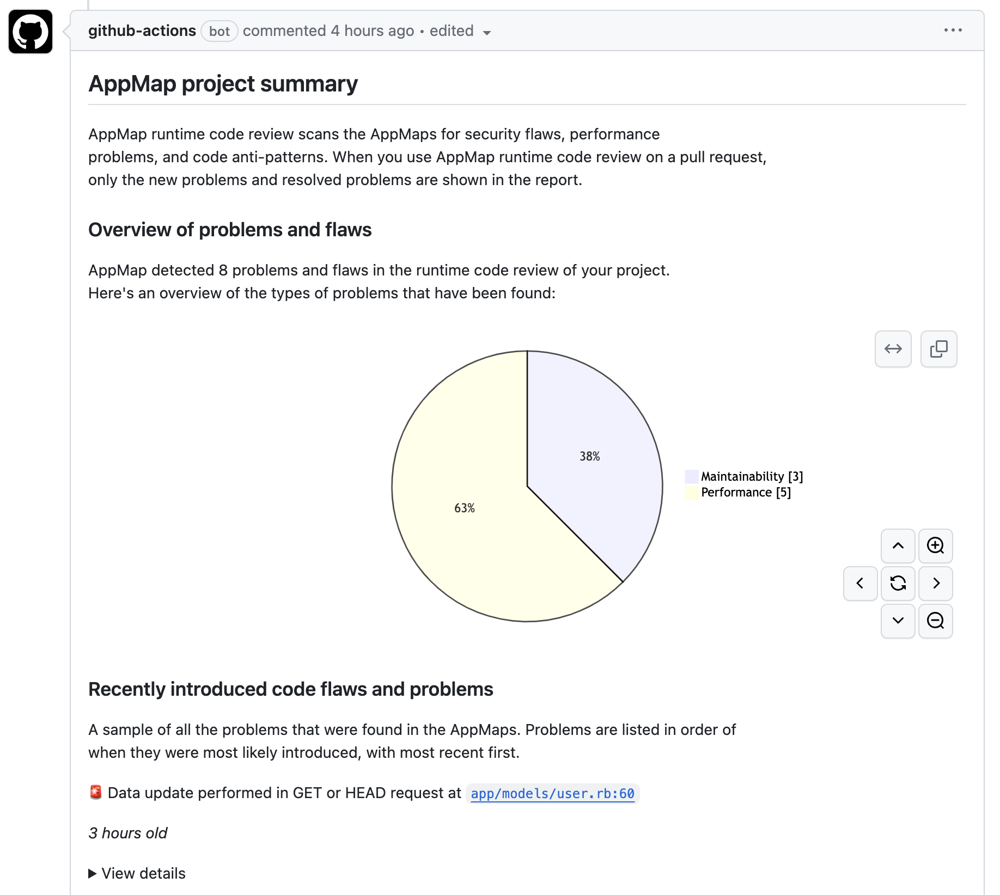
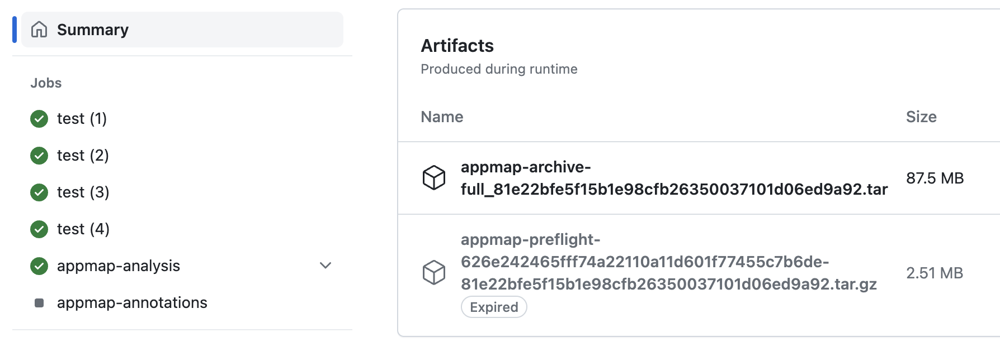

# getappmap/analyze-action <!-- omit from toc -->

> To get started with AppMap in GitHub actions, you need to start by installing the
> [AppMap App on the official GitHub Marketplace](https://github.com/marketplace/get-appmap)
>
> To see a step-by-step example of how to install this action into your software project,
> [review the official AppMap Documentation](http://appmap.io/docs/analysis/in-github-actions).

`getappmap/analyze-action` is a GitHub Action to perform runtime code review of the changes between
any two versions of a project.

Runtime code review is performed by comparing two AppMap archives - "base" and "head". The "base"
archive is created by the  
[`getappmap/archive-action`](https://github.com/getappmap/archive-action/blob/main/action.yml)
Action when code is merged to main. The "head" archive is created by this Action as part of its
operation.

The report generated by this Action includes root cause analysis of failed tests, a list of API
changes, new and resolved analysis findings (anti-patterns and flaws), and lists of new and changed
AppMaps. This action also adds code annotations which identify the root cause of failed tests and
analysis findings.

## Table of contents <!-- omit from toc -->

- [Requirements](#requirements)
- [Inputs](#inputs)
- [Outputs](#outputs)
- [Effects](#effects)
  - [Submission of PR comment 'AppMap runtime code review'](#submission-of-pr-comment-appmap-runtime-code-review)
  - [Submission of PR comment 'AppMap project summary'](#submission-of-pr-comment-appmap-project-summary)
  - [Creation of 'check' annotations](#creation-of-check-annotations)
  - [Creation of artifact 'appmap-archive-full'](#creation-of-artifact-appmap-archive-full)
  - [Creation of artifact 'appmap-preflight-\<base\>-\<head\>'](#creation-of-artifact-appmap-preflight-base-head)
- [Examples](#examples)
- [Development](#development)

## Requirements

This action requires an [`archive-action`](https://github.com/getappmap/archive-action/) to have
successfully completed on the base SHA that is used for comparison.

## Inputs

Add a step like this to your workflow:

```yaml
- name: Archive AppMaps
  uses: getappmap/analyze-action@v1
    # Command working directory. Use this option this to install AppMap to a
    # subdirectory of a monorepo / multi-folder project. When this input is specified,
    # AppMaps that project will be written to the directory `$directory/tmp/appmap`.
    # Be aware of this in any subsequent steps.
    # Default: '.'
    directory: ./projects/backend

    # The base revision to compare against. The default is the GITHUB_BASE_REF, which
    # is the name of the base ref or target branch of the pull request in a workflow run.
    base-revision: ${{ github.event.pull_request.base.sha }}

    # The head revision to compare against. The default is the GITHUB_SHA, which
    # according to GitHub is the commit that triggered the workflow run.
    head-revision: ${{ github.event.pull_request.head.sha }}

    # The GitHub token to use with the GitHub API to enumerate AppMap Tools
    # releases.
    # Default: `${{ github.token }}`
    github-token: secrets.CUSTOM_GITHUB_TOKEN

    # The number of days of history to fetch in order to find the most recent ancestor that has
    # an AppMap archive. If an archive is not found, within this time window,
    # the entire history will be fetched. To disable history fetching completely, set this value to 0.
    # Default: 30
    fetch-history-days: 90

    # Number of days that the archive artifacts are retained for. Note that the AppMap archives created
    # by analyze-action are always built from the AppMaps on a PR branch, and therefore they are
    # inherently more ephemeral than the base branch AppMaps created the archive-action. Therefore
    # a fairly short retention period is recommended. If artifacts need to be re-generated for
    # some reason, the workflow job can be re-run.
    # Default: 7
    archive-retention-days: 14

    # Number of worker threads to use for processing the archive. Defaults to the
    # number of CPUs / cores, as reported by Node.js. If the worker machine has
    # a high number of CPUs/cores, the archive action may become I/O-bound rather
    # than CPU-bound, and better performance might be obtained by setting this
    # value to a lower number.
    thread-count: 4

    # Directories to ignore when generating annotations. Please enter the exclusions as a
    # space-separated list (e.g. build tmp dist).
    # Default: 'node_modules vendor'
    annotation-exclusions: 'virtualenv node_modules'

    # Sections to include in the report. Enter the sections as a space-separated list.
    # The default is to generate all sections except for those which are in beta / early access.
    # Contact [AppMap Support](mailto:support@appmap.io) to be included in any beta / early access
    # report features.
    include-sections: 'lorem ipsum'

    # Sections to exclude from the report. Enter the sections as a space-separated list.
    # The default is to generate all sections except for those which are in beta / early access.
    exclude-sections: 'test-failures api'

    # Enable the 'AppMap project summary` pull request comment. By default, this comment is submitted
    # during initial setup of AppMap for a project. You can use this option to request that the
    # comment be submitted on any workflow run.
    project-summary: true

    # Explicitly pass the issue number to the analyze function.  This is useful in cases where
    # you are triggering this action via a webhook from another service and the action is not aware
    # of which Pull Request to comment an analysis report on.
    issue-number: 14

    # Enable verbose logging of CLI subcommands. You can use the standard GitHub
    # Action log level option to control verbosity of this Action itself.
    # Default: false
    verbose: true
```

## Outputs

The action provides these outputs:

- `report-dir`: Directory containing the report files.

## Effects

### Submission of PR comment 'AppMap runtime code review'

`getappmap/analyze-action` submits a comment to the pull request with an analysis of the changes
between the base and head revisions. This report is a "diff" report - it only shows changes between
the base and head revisions. So, for example, if a performance problem or security flaw is
introduced in a pull request, that problem will be detected and presented in the report. Latent /
legacy problems are not presented in these reports. For that, see the next section 'AppMap project
summary'.



**Note** Creation of PR comments requires the permission `pull-requests: write`.

### Submission of PR comment 'AppMap project summary'

During initial setup, `getappmap/analyze-action` submits a comment to the pull request with a
summary of the problems and flaws that are detected in the project. Unlike the 'AppMap runtime code
review' report, the 'project summary' report is not a diff report. It shows all problems and flaws
that are detected in the project, regardless of whether they are new or not.

You can request this comment to be submitted on any workflow run by setting the action input
`project-summary: true`.



**Note** Creation of PR comments requires the permission `pull-requests: write`.

### Creation of 'check' annotations

If a pull request contains test failures, security flaws, or performance problems that are not
present in the base revision, `getappmap/analyze-action` will create annotations on the pull
request. Each annotation is a detailed comment on a specific line of code.

**Note** Creation of 'check' annotations requires the permission `checks: write`.

### Creation of artifact 'appmap-archive-full'

`getappmap/analyze-action` creates an AppMap archive file, which is a compressed TAR file, and
uploads the archive to the GitHub artifact store. This archive contains AppMaps of the head revision
of the pull request.

The archive is named for the commit SHA that was used to generate it. For example, if the commit SHA
is `6056b0cfbacd562f4a4f274122c4a5e85542e040`, the archive will be named
`appmap-archive-full_6056b0cfbacd562f4a4f274122c4a5e85542e040.tar`.

`getappmap/analyze-action` always runs in a pull request context, and the revision of the archive is
the revision of the pull request head.

You can view all artifacts created by a workflow by visiting the `Actions` tab in GitHub and looking
for the `Summary` section.



**Note** The AppMap archive will be retained for the number of days specified by the
`archive-retention-days` input, whose default is `7`.

### Creation of artifact 'appmap-preflight-\<base>-\<head>'

The primary job of `getappmap/analyze-action` is to compare the AppMaps in the base and head
revisions. When it has completed this job, it creates an artifact called
`appmap-preflight-<base>-<head>`.tar, where `<base>` and `<head>` are the base and head revisions,
respectively.

This tar file contains a lot of useful data about the two revisions, including:

- AppMaps from the base and head revisions that have an impact on the analysis.
- Sequence diagram diffs for each AppMap that has changed.
- Generated OpenAPI definitions for both branches.
- All AppMap scanner findings for both branches.

If you click on an AppMap or AppMap diff in the AppMap runtime code review report, the AppMap that
you open will be from this artifact.

**Note** Reading the base archive artifact requires the permission `actions: read`.

**Note** The retention period for this artifact is the same as the retention period for the
`appmap-archive-full`.

## Examples

To analyze the BASE and HEAD of a branch in a Pull Request and compare the difference in the runtime
of the code.

```yaml
- name: Analyze AppMaps
  uses: getappmap/analyze-action@v1
  if: github.event_name == 'pull_request'
  with:
    directory: ${{ inputs.directory }}
    base-revision: ${{ github.event.pull_request.base.sha }}
    head-revision: ${{ github.event.pull_request.head.sha }}
```

## Development

```
# Remove build artifacts
$ yarn clean

# Build the project
$ yarn build

# Run tests
$ yarn test

# Package the project into a distributable GitHub action
$ yarn package
```
